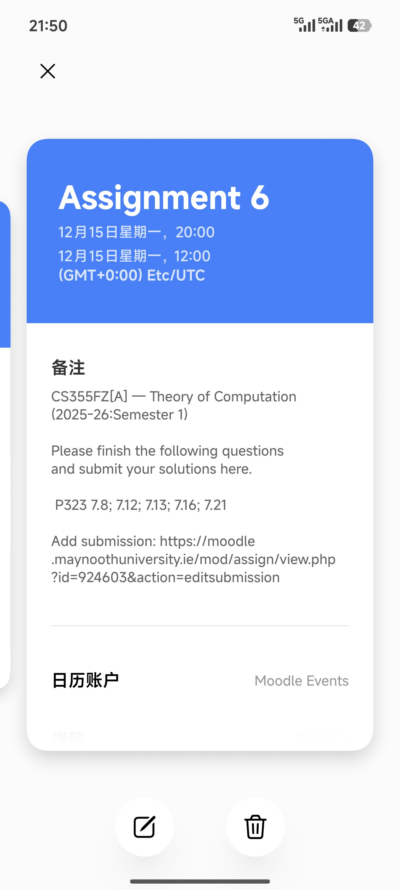

# Maynooth Moodle ICS Service

做了一个 Maynooth Moodle 日历订阅服务，方便将 Moodle 日程集成到个人日历应用中（其实理论上用 moodle 的都可以用，不一定要是梅努斯）

能够在日程中显示课程作业截止时间、作业内容等等。

目前仍然是一个比较初步的版本。

## 使用方法

1. 获取 token，我这边写了一个文档来告诉你怎么获取 token：[获取 Maynooth Moodle Token](https://www.yuque.com/seeridia/wzmvi5/dll14c8qdo4orwi4?singleDoc)
2. 替换 `YOUR_TOKEN_HERE` 为你的 token，得到的便是你的订阅链接：

   ```
   https://moodle.seeridia.top/calendar?token=YOUR_TOKEN_HERE
   ```
3. 将该链接添加到你的日历应用中（例如 Google Calendar、Apple Calendar、小米日历等）

### 环境变量配置

服务在启动时会验证必要的环境变量，建议按以下步骤配置：

1. 复制示例配置文件：

   ```bash
   cp .env.example .env
   ```

2. 编辑 `.env` 文件，确认包含：

   - `PORT`：服务监听端口（默认 3000）
   - `MOODLE_URL`：Moodle WebService 端点，默认已设置为梅努斯的地址。

若缺失或格式错误，服务会在启动时报错并退出，避免使用到错误配置。

### 运行测试

本项目使用 Bun 内置测试框架进行单元测试：

```bash
# 运行测试（一次性）
bun test

# 运行测试（监听模式）
bun test --watch
```

## 预览

