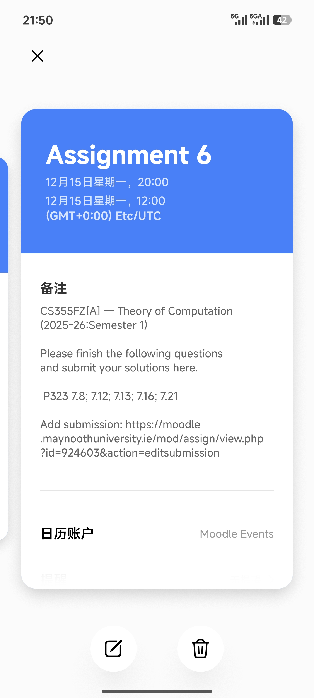

# Maynooth Moodle ICS Service

做了一个 Maynooth Moodle 日历订阅服务，方便将 Moodle 日程集成到个人日历应用中（其实理论上用 moodle 的都可以用，不一定要是梅努斯）

能够在日程中显示课程作业截止时间、作业内容等等。

目前仍然是一个比较初步的版本。

## 使用方法

1. 获取 token，我这边写了一个文档来告诉你怎么获取 token：[获取 Maynooth Moodle Token](https://www.yuque.com/seeridia/wzmvi5/dll14c8qdo4orwi4?singleDoc)
2. 替换 `YOUR_TOKEN_HERE` 为你的 token，得到的便是你的订阅链接：

   ```
   https://moodle.seeridia.top/calendar?token=YOUR_TOKEN_HERE
   ```
3. 将该链接添加到你的日历应用中（例如 Google Calendar、Apple Calendar、小米日历等）

可以使用 `leadTime` 设置提前提醒分钟数，范围为 `0` 到 `10080`。使用
`-1` 可以关闭提醒；未提供时会在事件发生时提醒：

```text
https://moodle.seeridia.top/calendar?token=YOUR_TOKEN_HERE&leadTime=30
```

订阅地址中的 token 等同于 Moodle 登录凭证，请勿公开分享。部署时也应确保
反向代理和访问日志不会记录完整的 `token` 查询参数。

### 环境变量配置

服务在启动时会验证必要的环境变量，建议按以下步骤配置：

1. 复制示例配置文件：

   ```bash
   cp .env.example .env
   ```

2. 编辑 `.env` 文件，确认包含：

   - `PORT`：服务监听端口（默认 3000）
   - `MOODLE_URL`：Moodle WebService 端点（默认使用 Maynooth Moodle）
   - `MOODLE_TIMEOUT_MS`：请求 Moodle 的超时时间（默认 10000 毫秒）

环境变量为空时会使用上述默认值；提供的端口、URL 或超时格式错误时，服务会在
启动阶段报错并退出。

### 运行测试

本项目使用 Bun 内置测试框架进行单元测试：

```bash
# 运行测试（一次性）
bun test

# 运行测试（监听模式）
bun test --watch

# 类型检查
bun run typecheck
```

## 部署到阿里云 ACR

生产镜像托管在杭州 ACR 个人版仓库：

```text
crpi-akjhmoniw59yirfb.cn-hangzhou.personal.cr.aliyuncs.com/seeridia/maynooth-moodle-ics
```

ACR 构建规则应保持为：Git 标签 `release-v$version` 构建仓库根目录的
`Dockerfile`，并将镜像版本设为 `$version`。代码变更自动构建需开启。当前规则
不会因 `main` 分支提交而生成镜像。

提交到 `main` 只运行测试、类型检查和 Docker 构建检查。先将本次 Compose 和 Actions
改动合入并推送到 `main`；CI 通过后，在该提交上创建并推送一个新的发布标签：

```bash
git tag release-v1.2.3
git push origin release-v1.2.3
```

ACR 会构建并推送 `1.2.3` 镜像；GitHub Actions 在测试通过后等待这个镜像出现，随后
通过 SSH 将 Compose 文件同步到服务器，拉取指定版本并更新服务。服务器不再现场构建，
更新时也不会先停止旧容器。发布标签应使用新的版本号，不要重复使用旧标签。

GitHub 仓库需要配置现有部署用的 `SERVER_HOST`、`SERVER_USER`、`SSH_PRIVATE_KEY`、
`TARGET_DIR` Secrets；`ENV_FILE` 可选。ACR 仓库当前为公开仓库，服务器拉取镜像不需要
在 GitHub Secrets 中保存 ACR 推送密码。

## 预览


